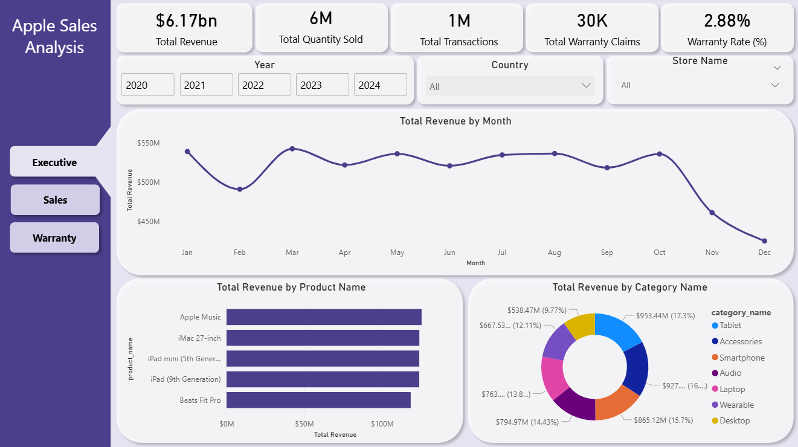
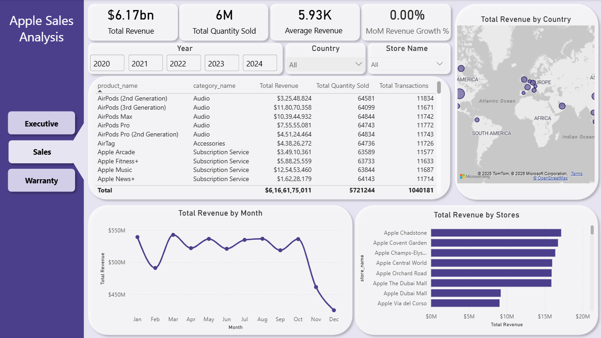
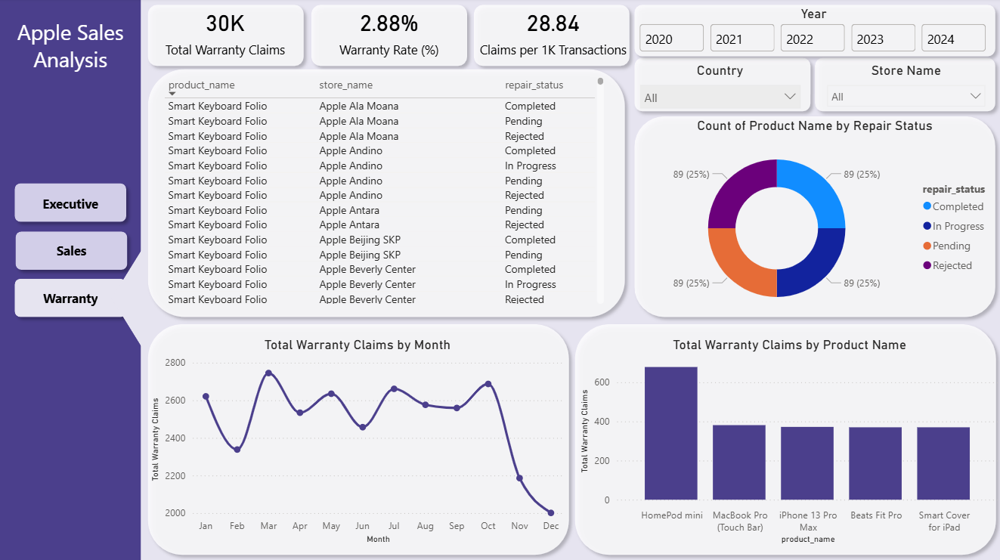

# Apple-Sales-Power-BI-Dashboard
Built an end-to-end Power BI dashboard to analyze Apple sales and warranty data across products, categories, stores, and regions. The report highlights executive KPIs, monthly sales trends, product performance, and post-sales warranty insights, using a clean, interactive UI with custom navigation and slicers.

